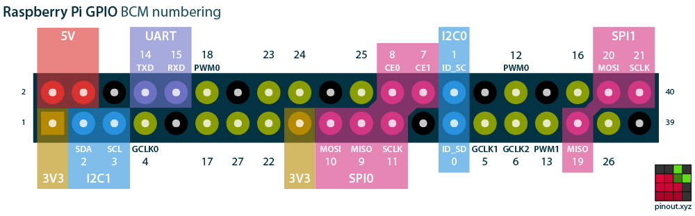

# pi-go-gpio
Simple GPIO library for Raspberry Pi in Go

This module implements a Go module to manipulate the GPIO pins.

Features
- only uses the sysfs mappings
- with a proper setup it can be used without being root
- tested on Raspberry Pi 3 / Raspberry Pi 4
- tested with Ubuntu Server 20.10 (Groovy Gorilla)

GPIO

This module uses the pin numbers to identify the GPIO ports.

This image from [https://pinout.xyz](https://pinout.xyz) helps to find the right pins.

## Setup
/*
We've whipped up a simple graphical .
Feel free to print, embed, share or hotlink this image and don't forget to credit us!
https://pinout.xyz
*/

